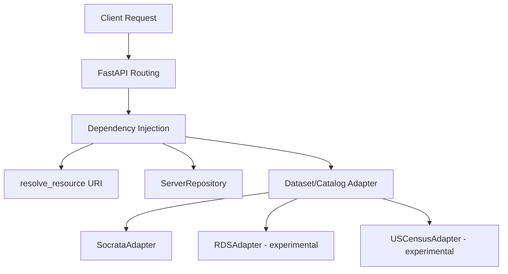

# Technical Implementation Details

This document describes the technical architecture and implementation details of `fairproxy-api`.

## Architecture Overview

`fairproxy-api` acts as a FAIRification proxy over heterogeneous datastores (Socrata, MTNA RDS, US Census). It exposes standardized dataset metadata (DCAT, Croissant, DDI-CDIF) and native payloads through a single unified API surface.

The architecture relies on the **Adapter Pattern** to dynamically resolve dataset URIs and instantiate the correct data provider (Adapter) to process requests.



## Repository Pattern & Configuration

The application uses the `ServerRepository` to retrieve metadata and connection info about data servers.

### Configuration Path Precedence

The default repository implementation `YamlServerRepository` parses a local YAML file (`servers.yaml`). To support external configuration (especially in containerized environments like Docker), the repository resolves the configuration file path in the following order:

1. **Environment Override**: The `FAIRPROXY_SERVERS_CONFIG` environment variable (if set).
2. **Container Path**: `/app/config/servers.yaml` (if the file exists).
3. **System Path**: `/etc/fairproxy/servers.yaml` (if the file exists).
4. **Embedded Default**: Packaged default `servers.yaml` resource file.

### Environment Variable & Container Volume Configuration

In a containerized setup, a custom configuration can be provided by mounting a local file to the default container path:

```yaml
services:
  api:
    image: dartfx/fairproxy-api:latest
    volumes:
      - ./my-servers.yaml:/app/config/servers.yaml:ro
```

Alternatively, the file can be mounted anywhere in the container and the environment variable specified:

```yaml
services:
  api:
    image: dartfx/fairproxy-api:latest
    environment:
      - FAIRPROXY_SERVERS_CONFIG=/opt/config/servers.yaml
    volumes:
      - ./my-servers.yaml:/opt/config/servers.yaml:ro
```

## Component Architecture

- **`models.py`**: Defines Pydantic data schemas for platforms, servers, and configuration details.
- **`dependencies.py`**: Defines FastAPI dependency providers for resolving resources (`get_dataset_adapter`, `get_catalog_adapter`, etc.).
- **`repositories/`**: Houses abstract interfaces (`ServerRepository`) and implementations (`YamlServerRepository`) to load data server registry configurations.
- **`adapters/`**: Platform-specific client wrappers matching the `DatasetProvider` and `CatalogProvider` interfaces.
- **`routers/`**: Handles request mapping to the corresponding adapters.
